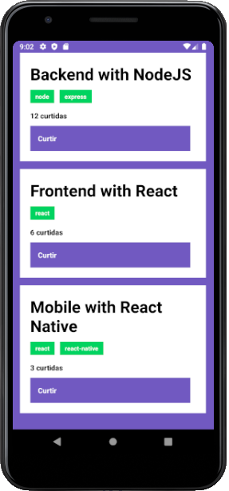

# Desafio 04: Conceitos do React Native

My solution to the Rockeseat's GoStack challenge.

✔ All tests passed.



To run tests:

```
yarn test
```

Refs.:

* The challenge: https://github.com/Rocketseat/bootcamp-gostack-desafios/tree/master/desafio-conceitos-react-native
* The template: https://github.com/Rocketseat/gostack-template-conceitos-react-native

---

Ermogenes Palacio